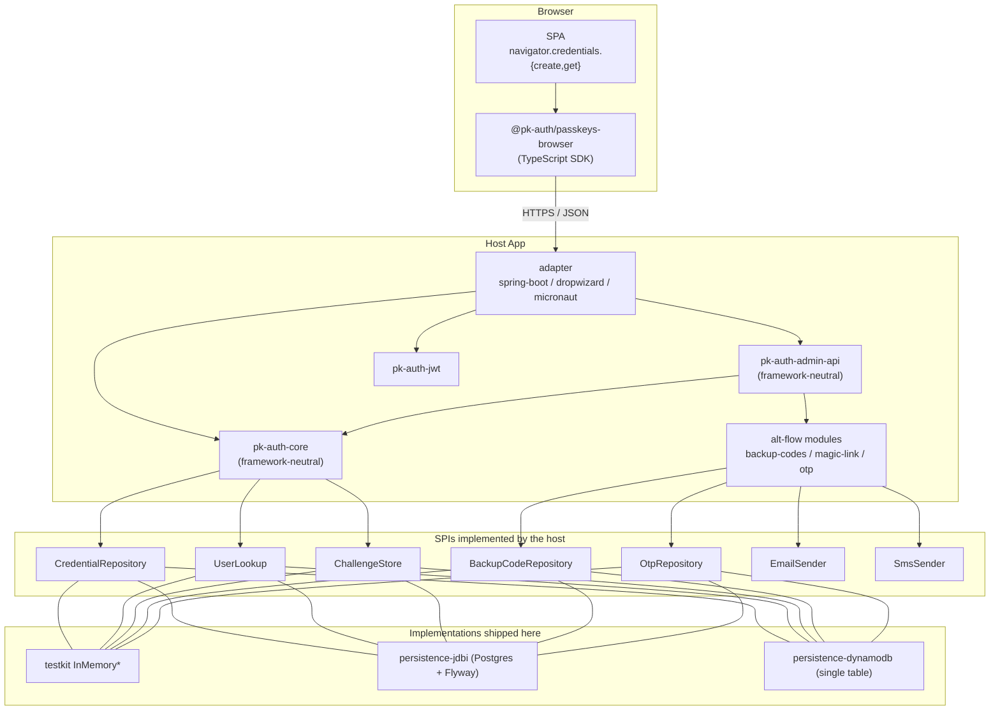

# pk-auth Design

pk-auth is a passkeys-first authentication library set for the JVM, split into a framework-neutral
core, host-implemented SPIs, and three framework adapters.

Related documents:

- [`README.md`](./README.md): features and demo instructions.
- [`docs/adr/`](./docs/adr/): per-decision rationale (numbered, sequential).
- [`docs/operator-guide.md`](./docs/operator-guide.md): running in production.
- [`docs/threat-model.md`](./docs/threat-model.md): security posture.
- [`docs/history/pk-auth-build-brief.md`](./docs/history/pk-auth-build-brief.md): the original
  bootstrap brief and phase plan (historical), superseded by this document and the ADRs.

## 1. Mission

pk-auth is a passkey-first authentication template that drops into any of the three mainstream JVM
web frameworks. Everything else is conventional: stateless JWT, configurable persistence, no
proprietary protocol on the wire, and no required external SaaS.

pk-auth has two non-goals:

- pk-auth is not an identity provider. It is the credential layer of the host's identity story. It
  does not own users; it stores passkeys and looks users up through the host's `UserLookup` SPI.
  See [ADR 0006](./docs/adr/0006-userlookup-spi-not-owned.md).
- pk-auth does not implement attestation policy. A pluggable hook (`AttestationTrustPolicy`)
  exists, but no MDS3 fetcher is bundled. Sites with FIDO-attestation requirements implement their
  own.

## 2. Architecture overview



The project is structured as three concentric rings:

1. Core (framework-neutral, persistence-neutral). Core knows about WebAuthn, JWT, and the wire
   contract. It has no dependencies on Spring, Dropwizard, Micronaut, JDBC, DynamoDB, HTTP, or any
   servlet API. It exposes services and SPIs.
2. SPIs (ports). These are the interfaces the host implements. The core-resident ones live in
   `pk-auth-core/spi` (the required `CredentialRepository`, `UserLookup`, and `ChallengeStore`,
   plus `BackupCodeRepository`, `OtpRepository`, and the optional `AttestationTrustPolicy`,
   `OriginValidator`, `ClockProvider`, `ConsumedJtiStore`, `CeremonyRateLimiter`);
   `UserDeletionListener` is in `pk-auth-core/lifecycle`. The remaining ports ship with the feature
   modules that own them: `SmsSender` (`pk-auth-otp`), `EmailSender` (`pk-auth-magic-link`),
   `AccessTokenStore` / `TokenTtlPolicy` / `RevocationCheck` (`pk-auth-jwt`), and
   `RefreshTokenRepository` (`pk-auth-refresh-tokens`). The §6 table below lists the owning module
   for each.
3. Adapters. Three adapters exist: Spring Boot, Dropwizard, and Micronaut. Each adapter mounts the
   same JSON contract under `/auth/**` and delegates to the core.

Dependency arrows point inward: adapters depend on core, and core depends on no adapter. The
persistence modules and alt-flow modules implement SPIs declared in core and are wired in by the
host.

## 3. Module layout

| Module | Purpose |
|---|---|
| `pk-auth-core` | Framework-neutral ceremony engine. `PasskeyAuthenticationService` is the entry point; `api/`, `ceremony/`, `config/`, `credential/`, `error/`, `json/`, `lifecycle/`, `metrics/`, `ratelimit/`, and `spi/` are exported (see `module-info.java`). Hosts the `UserDeletionService` fan-out and `UserDeletionListener` SPI ([ADR 0016](./docs/adr/0016-user-deletion-fan-out.md)). |
| `pk-auth-jwt` | HS256 JWT mint (`PkAuthJwtIssuer`) + validate (`PkAuthJwtValidator`). Nimbus JOSE+JWT under the hood. Hosts the `TokenTtlPolicy` SPI for per-audience access-token TTL dispatch ([ADR 0014](./docs/adr/0014-per-audience-ttl-policy.md)) and the `AccessTokenStore` SPI for stateful (server-revocable) access tokens ([ADR 0015](./docs/adr/0015-stateful-access-tokens.md)). |
| `pk-auth-backup-codes` | Alt flow: generate, hash (Argon2id), and atomically claim view-once backup codes. |
| `pk-auth-magic-link` | Alt flow: random-token magic links over the host's email dispatcher. |
| `pk-auth-otp` | Alt flow: 6-digit OTPs over the host's SMS dispatcher; hashed with HMAC-SHA256 (server-side pepper) and atomic-claim. |
| `pk-auth-refresh-tokens` | Rotating refresh tokens with family-based replay defence. `RefreshTokenService` + `RefreshTokenRepository` SPI; `RefreshHandler` is the framework-neutral `POST /auth/refresh` composer ([ADR 0013](./docs/adr/0013-refresh-tokens-family-rotation.md)). |
| `pk-auth-admin-api` | `AdminService` exposes account/credential/backup-code/email/phone operations. Result-typed (`AdminResult<T>` sealed sum). |
| `pk-auth-persistence-jdbi` | SPI impls on JDBI + Postgres + Flyway. Migrations at `src/main/resources/db/migration/`. |
| `pk-auth-persistence-dynamodb` | SPI impls on AWS SDK v2 DynamoDB Enhanced. Single table, schema per item-type ([ADR 0008](./docs/adr/0008-dynamodb-single-table-design.md)). |
| `pk-auth-testkit` | `FakeAuthenticator` for ceremony-driving tests + `InMemoryX` for every SPI. |
| `pk-auth-spring-boot-starter` | Spring Boot 4 / Spring Security 7 autoconfigure + controller. |
| `pk-auth-dropwizard` | Dropwizard 5 `ConfiguredBundle` + Dagger 2 wiring + Jersey resources. |
| `pk-auth-micronaut` | Micronaut 4 controllers + `@Filter` JWT validation (no Micronaut Security). |
| `clients/passkeys-browser` | TypeScript SDK (npm: `@pk-auth/passkeys-browser`). ESM + CJS, zero deps, vitest-tested. |
| `examples/{spring-boot,dropwizard,micronaut}-demo` | Runnable demos with the shared SPA. |

## 4. The wire contract

Every adapter mounts the same paths and consumes and produces the same JSON shapes. The TypeScript
SDK targets this contract, and clients in other languages can target it too; nothing on the wire is
framework-specific.

### Ceremony endpoints (unauthenticated)

| Method | Path | Notes |
|---|---|---|
| `POST` | `/auth/passkeys/registration/start` | Returns `{challengeId, publicKey}` (WebAuthn creation options) |
| `POST` | `/auth/passkeys/registration/finish` | Persists the credential; returns the stored `CredentialSummary` |
| `POST` | `/auth/passkeys/authentication/start` | Returns `{challengeId, publicKey}` (WebAuthn request options) |
| `POST` | `/auth/passkeys/authentication/finish` | Mints a JWT; returns `{token}` |
| `POST` | `/auth/refresh` | Rotates a refresh token; returns `{refresh, access}` on success, `401 {detail}` on any failure. Only mounted when `pk-auth-refresh-tokens` is on the classpath and a `RefreshTokenRepository` SPI is bound. |

All three adapters mount these paths identically. The Dropwizard Jersey resources use the same
`@Path("/auth/passkeys")` (and `/auth/refresh`, `/auth/admin`) roots as the Spring and Micronaut
controllers, so the TypeScript SDK targets one path scheme everywhere with no per-client path
override.

### Admin endpoints

Admin endpoints require `Authorization: Bearer <jwt>`, with the exception noted in the table for
email completion.

| Method | Path | Notes |
|---|---|---|
| `GET` | `/auth/admin/account` | Current user summary |
| `GET` | `/auth/admin/credentials` | List passkeys |
| `PATCH` | `/auth/admin/credentials/{id}` | Rename a passkey |
| `DELETE` | `/auth/admin/credentials/{id}` | Delete (enforces last-credential guard → `409`) |
| `POST` | `/auth/admin/backup-codes/regenerate` | View-once plaintext batch |
| `GET` | `/auth/admin/backup-codes/count` | Remaining count |
| `POST` | `/auth/admin/email/start-verification` | Dispatch magic link |
| `POST` | `/auth/admin/email/complete-verification` | Consume token (no auth; the recipient redeems via the emailed link) |
| `POST` | `/auth/admin/phone/start-verification` | Dispatch OTP |
| `POST` | `/auth/admin/phone/complete-verification` | Verify OTP |

### Wire conventions

- Bytes: every byte field on the wire is base64url with no padding (RFC 4648 §5). The core's
  `PkAuthObjectMappers.pkAuthModule()` registers serialisers and deserialisers for `byte[]`,
  `UserHandle`, and `ChallengeId`, so adapters using Jackson 3 get the right shape automatically.
  The Dropwizard and Micronaut adapters still use Jackson 2 and register equivalent Jackson 2
  modules for the same effect (`PkAuthJacksonBridge` and the `PkAuthJacksonModule` bean,
  respectively).
- Errors: `4xx` with a JSON body `{ "outcome": "<kind>", "error": "<kind>", "detail": "..." }`.
  `outcome` and `error` both carry the same machine-readable tag, so clients keyed off either field
  keep working; `detail` is present only when the result variant carried one. Common kinds:
  `validation_failed`, `origin_mismatch`, `counter_regression`, `challenge_expired`, `conflict`,
  `forbidden`, `not_found`, `rate_limited`. `rate_limited` is paired with a `Retry-After` response
  header. `AdminResponseMapper` in `pk-auth-admin-api` is the source of truth for the admin status
  codes and error envelope; each adapter wraps it in a thin native-HTTP mapper.
- Idempotence: `finish` endpoints are not idempotent. Challenges are single-use
  (`ChallengeStore.takeOnce`).

## 5. Core types

The following core types matter for any non-trivial integration.

- `UserHandle` (`pk-auth-core/api`) is an opaque, stable byte identifier for a user. It is
  generated on first-passkey registration and, once bound to a passkey, must remain stable for that
  user across all future calls. The host's `UserLookup` is responsible for the
  `(username, email) ↔ UserHandle` mapping. See
  [ADR 0006](./docs/adr/0006-userlookup-spi-not-owned.md).
- `ChallengeId` is an opaque random identifier (a UUID string) issued by `ChallengeStore.create`
  and atomically consumed by `ChallengeStore.takeOnce`. The atomicity is the only thing preventing
  challenge replay.
- `AdminResult<T>` is a sealed sum. Every admin operation returns one of
  `Success<T> | NotFound | Forbidden | ValidationFailed | Conflict | RateLimited`. Adapters
  pattern-match it into HTTP status codes.
- `RegistrationResult` and `AssertionResult` are sealed sums returned by the core ceremony service.
  The adapter wraps them in `Response.ok(...)` on success or maps the explicit failure variants to
  the right HTTP code.

## 6. SPIs

The SPIs are the host's only mandatory contact surface with pk-auth, and they are narrow.

| SPI | Module | Required? | Notes |
|---|---|---|---|
| `UserLookup` | `pk-auth-core` | Yes | Maps `(username/email) ↔ UserHandle`. Atomic find-or-create on first registration. |
| `CredentialRepository` | `pk-auth-core` | Yes | Insert / list-by-user / update / delete / find-by-id. |
| `ChallengeStore` | `pk-auth-core` | Yes | `create(...)`, `takeOnce(challengeId)`; atomic single-use. |
| `BackupCodeRepository` | `pk-auth-core` | Only if backup codes are enabled | Hashed-storage CRUD + atomic claim. |
| `OtpRepository` | `pk-auth-core` | Only if phone OTP is enabled | Same shape as backup codes. |
| `EmailSender` | `pk-auth-magic-link` | Only if magic-link is enabled | `send(to, subject, body)`. |
| `SmsSender` | `pk-auth-otp` | Only if phone OTP is enabled | `send(phoneE164, body)`. |
| `AccessTokenStore` | `pk-auth-jwt` | Optional (paved road for revocability) | Stateful access tokens. Issuer calls `record` on issue, validator calls `exists` on every validate. Default `AccessTokenStore.noop()` preserves stateless behaviour. JDBI + DynamoDB implementations ship in-tree. See [ADR 0015](./docs/adr/0015-stateful-access-tokens.md). |
| `TokenTtlPolicy` | `pk-auth-jwt` | Optional | Per-audience access-token TTL dispatch. Static factories `TokenTtlPolicy.single(ttl)` and `TokenTtlPolicy.fixed(default, overrides)` cover the common cases. See [ADR 0014](./docs/adr/0014-per-audience-ttl-policy.md). |
| `RevocationCheck` | `pk-auth-jwt` | Optional | In-process deny-list for hosts that want fast invalidation of a small set of JTIs without persisting every issued token. Orthogonal to `AccessTokenStore`. |
| `RefreshTokenRepository` | `pk-auth-refresh-tokens` (`…refresh.spi`) | Only if `pk-auth-refresh-tokens` is wired | Storage SPI for the rotating refresh-token primitive. Load-bearing `rotateAtomically` atomically marks the parent used and inserts the successor. JDBI, DynamoDB, and in-memory impls ship; the contract is enforced by a parity test suite that includes the 8-thread concurrent-rotation race test. See [ADR 0013](./docs/adr/0013-refresh-tokens-family-rotation.md). |
| `UserDeletionListener` | `pk-auth-core` (`…lifecycle`, not `spi`) | Optional (extension point) | Hook for the `UserDeletionService` fan-out. The library auto-registers listeners for credentials, backup codes, OTPs, access tokens, and refresh tokens; hosts add their own to clean up host-owned tables on user delete. See [ADR 0016](./docs/adr/0016-user-deletion-fan-out.md). |
| `AttestationTrustPolicy` | `pk-auth-core` | Optional | Default policy is `none`. Override to enforce MDS3 / specific AAGUID lists. |
| `OriginValidator` | `pk-auth-core` | Optional | Default is config-driven exact-match. Override for tenancy-aware origins. |
| `ClockProvider` | `pk-auth-core` | Optional | Default is `Clock.systemUTC()`. Override in tests. |

In a fresh project, the testkit's in-memory implementations boot the stack end to end without any
SPI implementation. For production, the `pk-auth-persistence-jdbi` and
`pk-auth-persistence-dynamodb` modules already implement the storage SPIs against a real backend.

## 7. Framework wiring

### Spring Boot 4

```java
// build.gradle.kts
implementation("com.codeheadsystems:pk-auth-spring-boot-starter:<version>")
implementation("com.codeheadsystems:pk-auth-persistence-jdbi:<version>")  // optional

// application.yml
pkauth:
  relying-party:
    id: example.com
    name: My App
    origins: ["https://example.com"]
  jwt:
    secret: "${PKAUTH_JWT_SECRET}"   # ≥ 32 bytes
```

The starter autoconfigures everything if all required SPIs resolve (host or persistence module).
`UserLookup` is implemented as a Spring `@Bean` against the host's user table; that is the only
Spring-specific requirement.

### Dropwizard 5

```java
public class MyApp extends Application<MyConfig> {
  @Override
  public void initialize(Bootstrap<MyConfig> bootstrap) {
    PersistenceBindings persistence = PersistenceBindings.builder()
        .credentialRepository(creds)
        .userLookup(users)
        .challengeStore(challenges)
        .backupCodeRepository(backupCodes)
        .otpRepository(otps)
        .build();
    AltFlowOptions altFlows = AltFlowOptions.builder()
        .emailSender(email)
        .smsSender(sms)
        .adminAuthorizer(AdminAuthorizer.subjectScoped())
        .build();
    bootstrap.addBundle(new PkAuthBundle<>(persistence, altFlows));  // mounts /auth/**
  }
}
```

Wiring is Dagger 2 (compile-time DI; see [ADR 0004](./docs/adr/0004-dagger-for-dropwizard.md)). The
bundle expects the host config to implement `HasPkAuthConfig`, and a `PersistenceBindings` (a class
with a builder) describing which SPIs to plug in. The constructor shown above, taking
`AltFlowOptions`, is the recommended one: it builds the backup-code, magic-link, OTP, and admin
services from config and mounts `/auth/admin/**`. A one-argument `PkAuthBundle(persistence)` mounts
only the ceremony endpoints.

### Micronaut 4

```java
// Provide the SPIs as @Singleton beans; the controllers and JWT filter
// are autoloaded from the pk-auth-micronaut module.
@Factory
public class PersistenceFactory {
  @Singleton public CredentialRepository creds() { return new InMemoryCredentialRepository(); }
  // ... and so on for each SPI
}
```

The Micronaut adapter does not use Micronaut Security. A plain `@Filter` extracts and validates the
JWT, because the generics-heavy `SecurityRule<R extends HttpRequest<?>>` surface did not justify
its cost.

## 8. Persistence

Two real-backend modules ship in-tree, both implementing the same SPIs.

### JDBI + Postgres ([ADR 0003](./docs/adr/0003-jdbi-over-jpa.md))

- Migrations live under `pk-auth-persistence-jdbi/src/main/resources/db/migration/` (Flyway). The
  schema is hand-tuned for the SPI access patterns; there is no JPA / Hibernate.
- Tables: `users`, `credentials`, `challenges`, `backup_codes`, `otp_codes` (V1–V5, no `pkauth_`
  prefix), plus the append-only `pkauth_audit_events` table from V6.
- `V8__create_access_tokens.sql` and `V9__create_refresh_tokens.sql` add the stateful-access-token
  and refresh-token tables for the 1.1.0 SPIs. `V10__refresh_tokens_amr.sql` adds the `amr` (RFC
  8176 authentication-method-reference) column to `refresh_tokens`.
  `V11__challenges_user_verification.sql` persists the resolved per-ceremony user-verification
  requirement. `V12__users_username_case_insensitive.sql` makes username uniqueness
  case-insensitive (unique index on `lower(username)`) so the JDBI and DynamoDB backends share one
  identity model. It refuses to run, naming the offending rows, if the database already holds
  usernames differing only by case. `PkAuthJdbiSchema.CURRENT_SCHEMA_VERSION` is `"12"`.
- Magic-link tokens are not persisted: the JWT itself is the credential. Consumed JTIs live in a
  `ConsumedJtiStore` (in-memory by default; a shared backend replaces it for multi-replica
  deployments).
- Atomic-claim operations (`takeOnce`, `BackupCodeRepository.consume`, `OtpRepository.consume`) use
  conditional `UPDATE ... WHERE consumed_at IS NULL` / `consumed = FALSE` and return `boolean` so
  the caller can detect a race-lost claim. Credential delete is a hard delete (V7 dropped
  `revoked_at` / `revoked_reason`); audit history lives in the `pkauth.credential.deleted`
  structured log event.

### DynamoDB single-table ([ADR 0008](./docs/adr/0008-dynamodb-single-table-design.md))

- One physical table, with a schema per item type via `DynamoDbTable<T>` on the AWS SDK v2 Enhanced
  client.
- DynamoDB-native TTL runs on the `ttl` attribute (epoch seconds) of the core table;
  `DynamoDbSchemaBootstrapper` enables it there. It is set on challenge, OTP, and access-token
  items from the row's expiry, and on refresh-token items from expiry plus the cleanup retention.
  Magic links are not persisted (see above), so they have no items. Production tables provisioned
  via IaC must enable TTL on `ttl`. Host user records live in a separate `users` table
  (`PkAuthDynamoTables.users()`).
- The refresh-token layout writes three items per token (primary jti / user-index / family-index),
  so listings, family-scorch, and user-fan-out delete can all be served by the same physical table.
- Atomic-claim uses conditional-write `ConditionExpression`s; failed conditions surface as
  `ConditionalCheckFailedException` and are mapped to `AdminResult.Conflict` /
  `Challenge.Expired`.

### Testkit (in-memory)

- `pk-auth-testkit` ships `InMemoryX` for every SPI. The example apps default to these, so a fresh
  clone runs without external services.
- The implementations are backed by `ConcurrentHashMap`. They are not durable across restarts and
  are not for production.

## 9. The TS SDK

`clients/passkeys-browser/` is a zero-dependency TypeScript SDK that ships both ESM and CJS
bundles, published on npm as
[`@pk-auth/passkeys-browser`](https://www.npmjs.com/package/@pk-auth/passkeys-browser)
(`npm install @pk-auth/passkeys-browser`; its version tracks the pk-auth server release it speaks
to). It exposes two clients:

- `PkAuthCeremonyClient` provides full `register()` and `authenticate()` flows that wrap
  `navigator.credentials.{create,get}` and handle all the byte-array and base64url conversions.
- `PkAuthAdminClient` provides admin operations against `/auth/admin/**` with bearer-token auth. It
  takes a `getToken: () => string | null` callback at construction, so token storage stays in the
  consumer's hands.

```ts
const pk = new PkAuthClient({
  apiBase: "/",
  getToken: () => localStorage.getItem("pk-jwt"),
});
await pk.ceremonies.register({ username: "alice", label: "MacBook" });
const { token } = await pk.ceremonies.authenticate({ username: "alice" });
localStorage.setItem("pk-jwt", token);
```

The SDK's `dist/` is not committed. Gradle's `:buildPasskeysBrowserSdk` task runs
`npm ci && npm run build` to produce the bundle before each demo's `processResources` copies it
into the demo's static resources. The vitest suite covers the serialisers and HTTP layer;
ceremony and admin flows are covered end to end by the demos' Playwright suites.

## 10. JWTs

The default mint is HS256 with a configurable secret (`pkauth.jwt.secret`, ≥ 32 bytes). The default
TTL is one hour. Claims:

- `sub`: base64url-encoded `UserHandle`
- `iss` / `aud`: configurable per host; `aud` falls back to `JwtConfig.defaultAudience()` when the
  caller's `JwtClaims.audience` is null
- `iat` / `nbf` / `exp`: epoch seconds (`nbf` is `iat` minus `JwtConfig.notBeforeSkew()`)
- `jti`: random UUID, always set
- `pkauth.method`: the `AuthMethod` wire value (`passkey`, `backup-code`, `magic-link`, or
  `refresh`; there is no OTP value)
- `pkauth.amr`: array of RFC 8176 authentication-method references
- `pkauth.cred`: base64url credential id (passkey tokens only)
- any host-supplied `JwtClaims.additionalClaims` (which may not override the names above)

JWT verification (in adapter filters / Micronaut filter / Dropwizard authenticator) returns a
`JwtVerificationResult` sealed sum: `Success(JwtClaims)` or one of the failure variants
`InvalidSignature`, `Expired`, `NotYetValid`, `WrongIssuer`, `WrongAudience`, `Malformed`,
`MissingClaim`, `Revoked`.

### Per-audience TTLs

Since 1.1.0, `JwtConfig.ttlPolicy: TokenTtlPolicy` replaces the single `tokenTtl: Duration`. The
default policy returns the same TTL for every audience (`TokenTtlPolicy.single(ttl)`).
Multi-client deployments wire a `fixed(default, overrides)` policy so that web, cli, and mobile
audiences can carry different access-token lifetimes from a single issuer. The validator accepts
any audience in `defaultAudience ∪ ttlPolicy.knownAudiences()`. See
[ADR 0014](./docs/adr/0014-per-audience-ttl-policy.md).

### Stateful access tokens

The default is stateless access tokens, with short TTLs as the mitigation
([ADR 0005](./docs/adr/0005-stateless-jwt-default.md)). The `AccessTokenStore` SPI (1.1.0) adds an
opt-in stateful mode. When a store is wired, the issuer records every JTI and the validator checks
`exists` on every request, so logout, admin revoke, password reset, and user delete invalidate the
bearer well before `exp`. The default `AccessTokenStore.noop()` keeps the stateless behaviour. The
`RevocationCheck` SPI remains supported as a lighter-weight deny-list orthogonal to the store. See
[ADR 0015](./docs/adr/0015-stateful-access-tokens.md).

### Refresh tokens

The paved road for "session length beyond one hour" is the rotating-refresh-token primitive shipped
in `pk-auth-refresh-tokens` (1.1.0). The wire token is `{refreshId}.{secret}` (both halves
base64url); the secret is SHA-256 hashed at rest. Every `POST /auth/refresh` call is a single
ceremony and one row per rotation, with atomic mark-and-insert at the repository level and family
scorch on detected replay. The `RotateResult` sealed sum
(`Success | Replayed | Expired | Unknown | Revoked`) drives the adapter response. See
[ADR 0013](./docs/adr/0013-refresh-tokens-family-rotation.md).

## 11. Security stance

The full STRIDE pass lives in [`docs/threat-model.md`](./docs/threat-model.md). Highlights:

- Origin validation is strict by default, with a config-driven allow-list. Mismatches reject with
  `origin_mismatch`.
- Counter regression rejects by default. It is configurable to `warn` for sites where synced
  (counter-0) passkeys dominate, at the cost of weakening the clone-detection signal.
- Challenges are single-use and TTL-bounded (5 min default).
- Backup codes are Argon2id-hashed server-side. OTPs are hashed with HMAC-SHA256 using a
  server-side pepper (a CPU-heavy hash gives no protection against a 10^6 search space; the
  per-attempt cap and rate limiter are the brute-force defence). Backup-code plaintext is returned
  only at regeneration time (view-once).
- Last-credential guard: `DELETE /credentials/{id}` returns `409` if it would leave the user with
  zero passkeys. Backup codes are the intended recovery path, and a second passkey should be added
  before the first is removed.
- No PII is owned by pk-auth. The `UserLookup` SPI is the only channel to user data; pk-auth never
  stores names, emails, or display names of its own.

## 12. Build system

A single Gradle multi-project build holds the conventions in `build-logic/`:

- `pkauth.java-conventions`: JDK 21 toolchain, Error Prone, JSpecify, `-Xlint:all`, Spotless /
  google-java-format with the SPDX header. Also applied by the example apps.
- `pkauth.library-conventions`: `java-library`, `-Werror` (plus the automatic-module lint
  relaxations), Javadoc and sources jars, jar manifest attributes. `module-info.java` is
  per-module, not enforced by the convention.
- `pkauth.test-conventions`: JUnit Jupiter, AssertJ, Mockito, JaCoCo report and coverage gate.
  Testcontainers is a per-module test dependency of the persistence modules, not convention
  wiring.
- `pkauth.publish-conventions`: Maven Central publishing. v1.0.0 shipped through this path; see
  [`RELEASE.md`](./RELEASE.md) for the full release workflow.

JaCoCo enforces a LINE ≥ 70% / BRANCH ≥ 55% floor on every library module; individual modules
(core, jwt, admin-api, backup-codes, otp, refresh-tokens) raise it in their own
`build.gradle.kts`.

The version catalog is `gradle/libs.versions.toml`. Dependabot proposes bumps and is configured
(`.github/dependabot.yml`) to ignore specific known-problem versions (Micronaut 5.x needs JVM 25,
Spotless 8.x has a classloader bug, etc.). The Spring Boot 4 and Dropwizard 5 majors are not
pinned; major bumps are treated as framework refreshes, as in commits `7b59f01` and `803ea5b`.

## 13. Conventions

- Records are used over classes for DTOs, configs, and result variants. Sealed interfaces model
  closed sums (`AdminResult`, `JwtVerificationResult`, `RegistrationResult`).
- Null discipline: `@org.jspecify.annotations.NonNull` / `@Nullable` on every public method
  parameter and return type. JSpecify is loaded, and Error Prone catches violations.
- Public API is sealed via `module-info.java` exports. In `pk-auth-core` the exported packages are
  `api`, `ceremony`, `config`, `credential`, `error`, `json`, `lifecycle`, `metrics`, `ratelimit`,
  and `spi`; everything else is module-internal.
- No reflection runs in hot paths. The only reflection is Jackson's, confined to
  (de)serialisation boundaries.
- Commit messages follow conventional commits, with the rationale for any non-trivial decision in
  either the commit body or an ADR.

## 14. Further reading

- Algorithms and classes: the `api` / `spi` package of the relevant module, which is the contract
  surface.
- Operational concerns: [`docs/operator-guide.md`](./docs/operator-guide.md).
- Rationale: [`docs/adr/`](./docs/adr/). Every non-obvious decision has an ADR.
